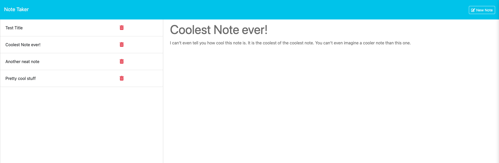

# Note Taker App

## Purpose of Application

This is an application where you can view all previous notes added as well as add any new notes for future viewing. Notes can also be deleted if no longer needed or necessary.

## Installation Instructions

Locally, clone or fork the repository and in the project directory:

`npm install` to install all the packages

`npm start` will start the application

Navigate to the address posted in the console to open the app locally

## Credits

The fsUtils file in the helpers directory was used from the Mini Project in Lesson 28 of Module 11. This was essentially saving time to re-utilize helper tools.

## Links to Resources

- [GitHub Url](https://github.com/mgordon82/note-taker-express-app)
- [Note Taker Site - hosted on Render](https://note-taker-express-app.onrender.com)

## Screenshot

